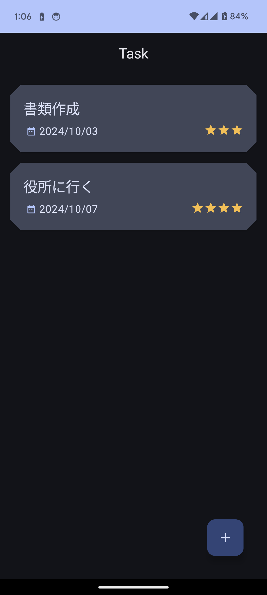
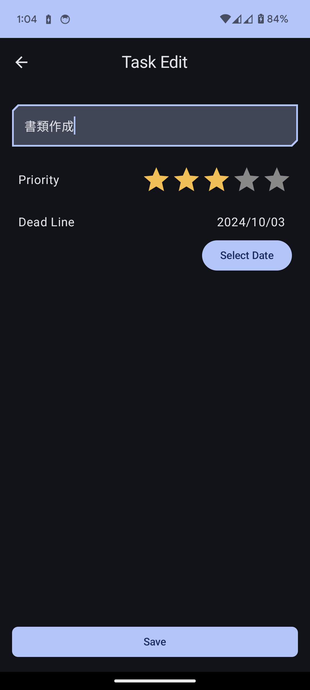
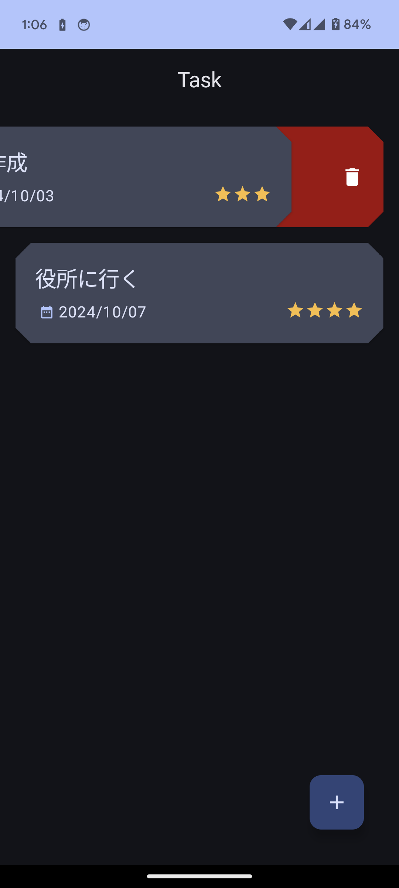

# Task-Ease App
MVVMアーキテクチャ学習用のサンプルコードです。

## Introduction
このAndroidアプリはToDo管理アプリです。
タスクの新規追加、編集、削除をおこなうことができます。

## Libraries used
- Jetpack compose
    - UIツールキット
- Room
    - ローカルデータベース
- Hilt
    - 依存注入  

---

          